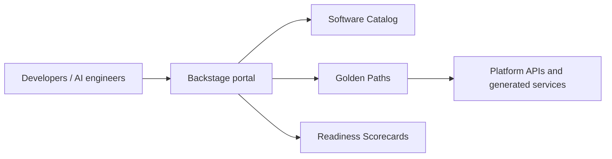

# AI Developer Platform

Foundation for a Backstage-based Internal Developer Platform: governed catalog metadata, golden-path contracts, versioned readiness standards, and scorecard fixtures.

## Honest status

This repository is a **foundation**, not a running Backstage portal yet. The catalog and Software Template descriptors are ready to be imported when the current Backstage application is scaffolded; they have not been executed through Backstage Scaffolder. The next milestone is an actual Backstage frontend/backend, live Catalog, one executed Production API path, and a real scorecard plugin.

The platform principle is: templates establish standards; scorecards detect drift and provide evidence-based remediation.
