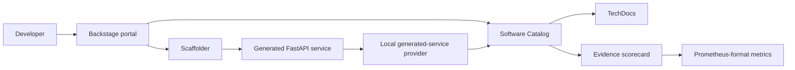

# AI Developer Platform

A local-first Internal Developer Platform built on Backstage. It turns a small set of developer inputs into a runnable, catalogued FastAPI service and continuously evaluates whether that service still meets the platform's production-readiness standard.

It is deliberately an experience layer—not an infrastructure bypass. Developers use templates and the Catalog; generated services still consume underlying platform APIs and must carry ownership, documentation, health, security, and deployment evidence.

## What works locally

Status: **LOCAL END-TO-END VALIDATED**. The primary path and clean-room reproducibility have executed locally; the branch is awaiting GitHub CI before it can be marked **PORTFOLIO COMPLETE — LOCAL-FIRST SCOPE**.

| Capability | Status | Evidence |
| --- | --- | --- |
| Backstage frontend, backend, Catalog, and Scaffolder | ✅ EXECUTED LOCALLY | `make bootstrap-local`, `make smoke` |
| Production API and AI Service golden paths | ✅ EXECUTED LOCALLY | `make demo-golden-path` |
| Generated FastAPI tests and hardened container | ✅ EXECUTED LOCALLY | `/health`, `/ready`, non-root/read-only runtime options |
| Catalog ownership/system/API relationships | ✅ EXECUTED LOCALLY | generated EntityProvider + browser E2E |
| TechDocs | ✅ EXECUTED LOCALLY | local TechDocs build and served HTML |
| Evidence-based scorecard and entity-page card | ✅ EXECUTED LOCALLY | backend tests + Playwright |
| Drift, legacy, and invalid-input failures | ✅ EXECUTED LOCALLY | `make demo-drift`, `make demo-failure` |
| Metrics | ✅ EXECUTED LOCALLY | `/api/platform-metrics/metrics` |
| GitHub publishing, enterprise identity, remote CI evidence | 🟡 IMPLEMENTED / NOT FULLY EXECUTED | intentionally outside local demo |

See [implementation status](docs/IMPLEMENTATION_STATUS.md) and [validation evidence](docs/VALIDATION.md) for exact boundaries.

## The developer contract

The portal lets a developer create either a **Production Web API** or an **AI Service** with a small, governed input set: name, owning team, system/cost context, and data classification where relevant. It generates a local repository with:

- FastAPI health and readiness endpoints;
- a non-root container and a read-only-compatible runtime;
- Helm defaults for resource limits, probes, and security context;
- catalog metadata, an API relationship, documentation, and CI workflow; and
- a scorecard that checks those artifacts rather than returning a hard-coded result.

The portal does **not** grant cloud or Kubernetes credentials, publish to GitHub, claim that generated services are deployed, or silently waive missing controls. Local guest authentication is for this demo only; enterprise identity is a production adapter.

## Architecture



## Run it from a clean project state

Prerequisites: Docker Desktop, Node 22 or 24 (the Makefile selects Homebrew Node 24 when available), Python 3, `curl`, and `jq`. No cloud account or Backstage SaaS account is required.

```bash
make install
make bootstrap-local
make smoke
make demo-golden-path
make demo-drift
make demo-failure
make e2e
make verify
make clean-local
```

`make demo-golden-path` creates a Production API and AI Service through the live Scaffolder, waits for Catalog reconciliation, tests both generated services, builds and runs the Production API container, builds/serves TechDocs, and asserts scorecard readiness. `make demo-drift` removes a required readiness annotation temporarily and proves the scorecard blocks it with remediation. `make demo-failure` proves invalid template input is rejected before a workspace is created.

`make clean-local` deletes only this repository's generated services, SQLite state, local virtual environments, Backstage process, and explicitly named demo images/containers. It does not prune Docker or touch unrelated resources.

## Scorecard scenarios

| Scenario | Expected outcome |
| --- | --- |
| Golden-path service | `READY`, with ownership, docs, CI, health, container, and deployment controls evidenced |
| A required annotation is removed | `BLOCKED`, with a specific remediation message |
| `legacy-api` | `BLOCKED` because real required artifacts are absent |
| Invalid service name | HTTP 400; no generated workspace or Catalog registration |

## Local vs production

Executed locally: Backstage, SQLite-backed Catalog/Scaffolder state, generated-service reconciliation, TechDocs via Docker, FastAPI generated service, Docker build/runtime, Prometheus-format metrics, and browser E2E.

Not executed: GitHub repository publishing, enterprise OIDC/RBAC, remote CI evidence, Kubernetes deployment, external catalog providers, and cloud platform APIs. These are explicitly not presented as local validation.

## Portfolio relationship

This is Project 9 in the AI Infrastructure portfolio. It makes approved platform capabilities discoverable and self-service; it can conceptually call Project 1 control-plane APIs, expose Project 7 model-release capabilities, and surface signals from Project 4 observability—without requiring those repositories to run for this local demo.
